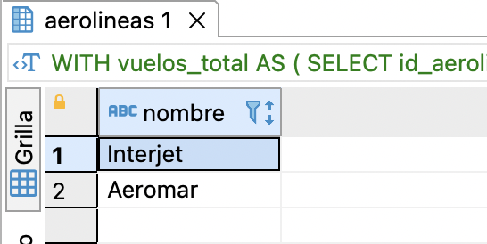
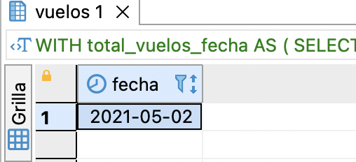

## Como levantar los datos con docker:

1. Levante un contenedor con postgres usando el comando: `docker run -it -e POSTGRES_PASSWORD=postgres -e POSTGRES_USER=postgres -e POSTGRES_DB=flys -p 5432:5432 postgres`
2. Configure su conexion en un gestor de base de datos(Dbeaver o DataGrip) con los valores de las variables de entorno definidas previamente al levantar el contenedor
3. Ejecute el contenido del archivo `datos_aerolineas.sql` en la base de datos

## Como levantar los datos con [SQL Fiddle](https://ejemplo.com/)

1. Asegurate que seleccionaste postgres 
2. En el panel izquierdo copia y pega el contenido de `datos_aerolineas.sql` y por ultimo selecciona build schema

1. Ahora podras ejecutar las querys del lado derecho
   

## ¿Cuál es el nombre del aeropuerto que ha tenido mayor movimiento durante el año?

Ejecute la query:
```
WITH movimientos_total AS (

SELECT id_aeropuerto, 
       COUNT(*) AS total
  FROM vuelos
 GROUP BY id_aeropuerto
),
aeropuerto_posiciones AS (

SELECT id_aeropuerto, 
       RANK () OVER(ORDER BY total DESC) AS position
       FROM movimientos_total
)
SELECT aeropuertos.nombre
  FROM aeropuerto_posiciones
       LEFT JOIN aeropuertos
       ON aeropuerto_posiciones.id_aeropuerto = aeropuertos.id
 WHERE position = 1;
```

Resultado:


Dos aeropuertos registran el mayor numero de movimientos durante el año.

## ¿Cuál es el nombre de la aerolínea que ha realizado mayor número de vuelos durante el año?

Ejecute la query:
```

WITH vuelos_total AS (

SELECT id_aerolinea, 
       COUNT(*) AS total
  FROM vuelos
 GROUP BY id_aerolinea
),
aerolinea_posiciones AS (

SELECT id_aerolinea, 
       RANK () OVER(ORDER BY total DESC) AS position
       FROM vuelos_total
)
SELECT aerolineas.nombre
  FROM aerolinea_posiciones
       LEFT JOIN aerolineas
       ON aerolinea_posiciones.id_aerolinea = aerolineas.id
 WHERE position = 1;
```

Resultado:



Dos aerolineas registran el mayor numero de vuelos durante el año.

## ¿En qué día se han tenido mayor número de vuelos?

Ejecute la query: 
```
WITH total_vuelos_fecha AS (

SELECT fecha, 
       COUNT(*) AS total
  FROM vuelos
 GROUP BY fecha
),
fecha_posiciones AS (

SELECT fecha, 
       RANK () OVER(ORDER BY total DESC) AS position
       FROM total_vuelos_fecha
)
SELECT fecha_posiciones.fecha
  FROM fecha_posiciones
 WHERE position = 1;
```

Resultado:



El dia con más vuelos fue el dia ´2021-05-02´

## ¿Cuáles son las aerolíneas que tienen mas de 2 vuelos por día?

Ejecute la query:
```
SELECT id_aerolinea, 
       fecha,
       COUNT(*) AS total
  FROM vuelos
 GROUP BY id_aerolinea, fecha
HAVING COUNT(*) > 2;
```

Resultado: Ninguno, no hay aerolineas que tengan más de dos vuelos por dia. Sin embargo si hay aerolineas con dos vuelos por dia.